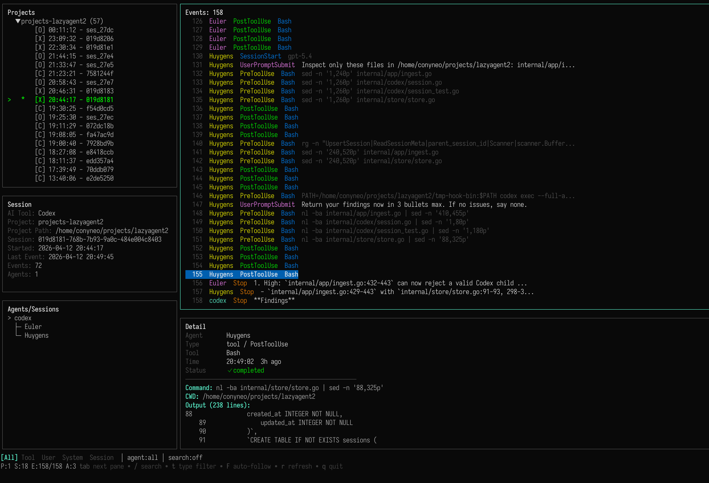
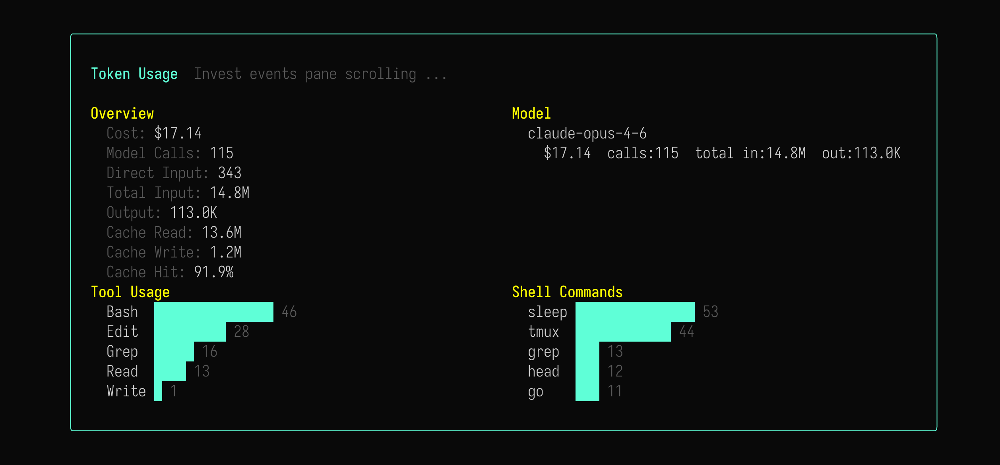

# lazyagent



`lazyagent` is a terminal TUI app for watching what ai agents are doing. You can inspect projects, sessions, agents, subagents, tools, prompts and outputs in one place.

The TUI is built for day to day observability. You can see which session belongs to which project, which agent or subagent is active, what tool ran, and what happened next.

It also helps you check whether each agent is doing the work that fits its role, so it is easier to spot when a run goes off track.



You can also check token usage breakdowns for each session, so you can see how many tokens were spent on the model, how many were saved by cache reuse, and how many were spent on cache creation.

## Features

- **Multi-runtime support** -- Support Claude, Codex, and OpenCode sessions
- **Subagent hierarchy** -- See which agents spawned which subagents, displayed as a visual tree.
- **Event stream with filtering** -- Filter events by type (tool, user, session, system, code) or by agent. Full-text search across event payloads.
- **Syntax and diff highlighting** -- Code blocks and diffs in event payloads are syntax-highlighted for readability.

> lazyagent is still early in development, some breaking changes may happen.

## Installation

### NPM

```bash
npm install -g @chojs23/lazyagent
```

Or run without installing:

```bash
npx @chojs23/lazyagent
```

### Homebrew

Install from the Homebrew tap with:

```bash
brew tap chojs23/homebrew-tap
brew install --cask lazyagent
```

### Go install

```bash
go install github.com/chojs23/lazyagent/cmd/lazyagent@latest
```

### Nix flake

These commands build the repository through its flake. The binary version comes from the repo `VERSION` file, while the exact source you install depends on the ref you choose.

Run directly:

```bash
nix run github:chojs23/lazyagent
```

Install into your profile:

```bash
nix profile install github:chojs23/lazyagent
```

Pin a specific release tag if you want that exact release through Nix:

```bash
nix run github:chojs23/lazyagent/v0.2.0
nix profile install github:chojs23/lazyagent/v0.2.0
```

The default `github:chojs23/lazyagent` form follows the default branch, so use a tag ref when you want a fixed release.

### Release install script

Install the latest release asset into `~/.local/bin`:

```bash
curl -fsSL https://raw.githubusercontent.com/chojs23/lazyagent/main/scripts/install.sh | sh
```

Install a specific release into a custom directory:

```bash
curl -fsSL https://raw.githubusercontent.com/chojs23/lazyagent/main/scripts/install.sh | \
  sh -s -- --version v0.2.0 --bin-dir /usr/local/bin
```

Installer options:

- `--version <tag>` or `VERSION=<tag>` to install a specific release
- `--bin-dir <dir>` or `BIN_DIR=<dir>` to choose the install directory

### Build from source

```bash
go build -o ./bin/lazyagent ./cmd/lazyagent
```

## Claude, Codex, and OpenCode setup

`lazyagent` is usually used through runtime hooks and plugins.

### Claude

```bash
lazyagent init claude
```

This updates:

```text
~/.claude/settings.json
```

It registers `lazyagent ingest --runtime claude` for these Claude hook events:

- `PreToolUse`
- `PostToolUse`
- `SessionStart`
- `SessionEnd`
- `Stop`
- `SubagentStop`
- `Notification`
- `UserPromptSubmit`

Existing non `lazyagent` hooks are preserved.

### Codex

```bash
lazyagent init codex
```

This updates:

```text
~/.codex/config.toml
~/.codex/hooks.json
```

It enables `features.codex_hooks = true` and registers `lazyagent ingest --runtime codex --quiet` for supported Codex hook events.

### OpenCode

```bash
lazyagent init opencode
```

This writes the OpenCode plugin to:

```text
~/.config/opencode/plugins/lazyagent.ts
```

Set an environment variable for the plugin if you want:

- `LAZYAGENT_BIN` to point at a specific `lazyagent` binary

## Build and test

Build the Go binary:

```bash
go build -o ./bin/lazyagent ./cmd/lazyagent
```

Run the Go test suite:

```bash
go test ./...
```

If you need to work on the maintained OpenCode plugin source directly:

```bash
cd plugins/opencode
npm install
npm run build
```

The shipping plugin is embedded into the Go binary, so keep the maintained source and embedded copy in sync when you change it.

## TUI layout

The interface is divided into five panes.

1. **Projects** -- Lists all projects with their root sessions. Each session shows a runtime indicator: `[C]` for Claude, `[X]` for Codex, `[O]` for OpenCode. Active sessions display an animated spinner.
2. **Session summary** -- Shows metadata for the selected session: runtime, project path, session ID, start time, last event time, and event/agent counts.
3. **Agents / subagents** -- Displays the agent tree for the selected session. Active agents show a spinner.
4. **Events** -- List of events for the selected session. Each row shows the event type, tool name, agent ID, and timestamp.
5. **Event detail** -- Full inspection of the selected event. Shows status indicators, metadata fields, and the event payload.

## Keybindings

Main keys:

- `tab`, `shift+tab` move between panes
- `1`, `2`, `3`, `4`, `5` jump to a specific pane
- `j`, `k` move through lists
- `g`, `G` jump to top or bottom
- `ctrl+u`, `ctrl+d` move by half a page
- `enter`, `space` select the current item
- `/` opens search
- `t`, `shift+t` cycles event type filters
- `b` opens the token/tool usage overlay for the selected session
- `a` clears the current agent filter when the agent pane is focused
- `d` deletes the selected project or session from the projects pane
- `D` clears events for the selected session tree
- `F` toggles auto follow in the events pane
- `r` refreshes data
- `?` toggles help
- `q` quits
- Hold `shift` while dragging to select and copy text

When a non panic internal app error happens, the TUI shows a small toast in the
bottom right for about 5 seconds while also writing the error to
`lazyagent.log`.

Detail pane keys:

- `J` toggles raw JSON
- `e` expands long content blocks

## Usage

Run the lazyagent:

```bash
lazyagent
```

Project grouping is automatic. `lazyagent` first tries to match sessions by working directory such as `cwd` or `project_dir`, then falls back to transcript path information when needed. That means Claude, Codex, and OpenCode sessions from the same worktree are usually grouped under the same project in the TUI.

### Filtering and search

- **Type filter** -- Press `t` to cycle through: All, User, Message, Code, System, Tool, Session.
- **Agent filter** -- Select an agent in the agents pane to show only that agent's events. Press `a` to clear the filter and show all agents again.
- **Text search** -- Press `/` and type a pattern to search event payloads.

### Token usage overlay

Press `b` on a selected session to open the token usage overlay.

The overlay is designed as a compact session audit sheet instead of a raw dashboard. It keeps the main TUI visible underneath and groups the data into a few ranked sections:

- **Session** -- Runtime, session label, and project context for the selected run.
- **Overview** -- Cost, model calls, direct input, total input, output, and cache numbers.
- **Signals** -- Derived hints such as cache share, output ratio, top model, top tool, and top command.
- **Model Ledger** -- Ranked per-model usage with share, calls, total input, and output.
- **Execution Mix** -- Ranked tools and commands used in the session.

- **Model Calls** -- Counted model usage events for the selected runtime.
- **Direct Input** -- Non-cache input tokens only.
- **Total Input** -- `Direct Input + Cache Read + Cache Write`.
- **Cache Read** -- Input tokens served from cache reuse.
- **Cache Write** -- Tokens spent creating cacheable prompt state.
- **Model `total in`** -- The per-model version of `Total Input`, so it includes direct input plus cache tokens.

- **Tool Usage** -- Which tools were called in the session and how many times each tool ran.
- **Shell Commands** -- Which shell commands were detected from Bash or shell tool invocations and how many times each command appeared.

### Event types

`lazyagent` tracks the following event types depending on the runtime.

| Type    | Subtypes                                                                                                                                             | Description                                                            |
| ------- | ---------------------------------------------------------------------------------------------------------------------------------------------------- | ---------------------------------------------------------------------- |
| User    | `UserPromptSubmit`                                                                                                                                   | User sent a prompt                                                     |
| Message | --                                                                                                                                                   | AI response output                                                     |
| Code    | --                                                                                                                                                   | Code-changing actions                                                  |
| System  | `Stop`, `SubagentStop`, `StopFailure`, `Notification`, `SessionStatus`, `PermissionReply`, `TodoUpdate`, `CommandExecuted`, `FileEdited`, and others | Agent stop, status, permission, todo, command, and other system events |
| Tool    | `PreToolUse`, `PostToolUse`, `PostToolUseFailure`                                                                                                    | Tool execution start, success, or failure                              |
| Session | `SessionStart`, `SessionEnd`, `SessionUpdated`, `SessionDiff`                                                                                        | Session lifecycle                                                      |

When a `PreToolUse` or `PostToolUse` event involves the `Agent` tool, `lazyagent` automatically creates a subagent entry and links subsequent events to it.

### Commands

#### `lazyagent init <claude|opencode|codex>`

Install or refresh runtime hooks and plugins.

Examples:

```bash
lazyagent init claude
lazyagent init codex
lazyagent init opencode
```

#### `lazyagent ingest`

Read runtime event payloads from stdin and store them in the database.

This command is normally called by hooks and plugins, not manually.

Examples:

```bash
lazyagent ingest --runtime claude
lazyagent ingest --runtime opencode
lazyagent ingest --runtime codex --quiet
```

#### `lazyagent health`

Check whether the SQLite database can be opened.

```bash
lazyagent health
```

#### `lazyagent version`

Show build and release metadata.

```bash
lazyagent version
lazyagent version --json
lazyagent --version
```

## DB and log information

By default, `lazyagent` stores data under:

```text
~/.lazyagent
```

Default database path(SQLite):

```text
~/.lazyagent/observe.db
```

Default log path:

```text
~/.lazyagent/lazyagent.log
```

Supported environment variables:

- `LAZYAGENT_DATA_DIR`
  - overrides the base data directory
- `LAZYAGENT_DB_PATH`
  - overrides the database path
  - when set, its parent directory also becomes the active data directory for logs

The TUI refresh interval defaults to 1 second.

## Contribution

Bug reports, feature requests, and pull requests are all welcome.

Please see [CONTRIBUTING.md](./CONTRIBUTING.md) for contribution guidance.

## License

MIT
